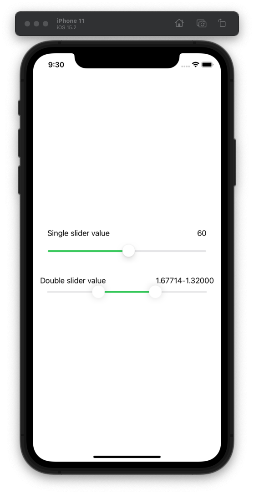

# SwiftUiCustomComponents

https://stackoverflow.com/questions/62587261/swiftui-2-handle-range-slider

## TODO

* Should calculate full width, probably using GeometryReader
* Needs to take in a step, we only want to update every 1 increment
* The Handle should stop when the right side touches end of line same as the single slider

## Screenshot

Screenshot.png

